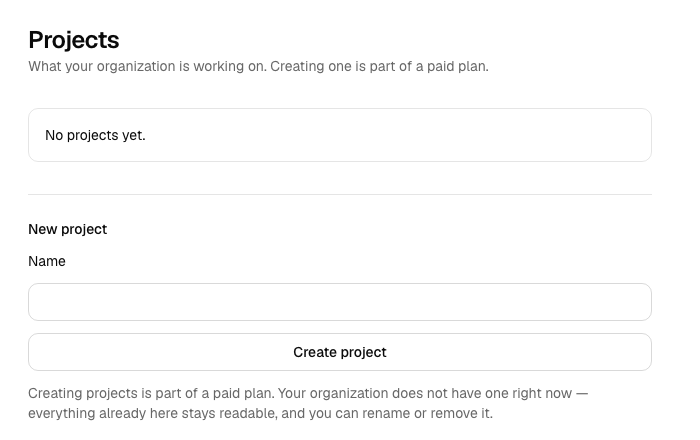
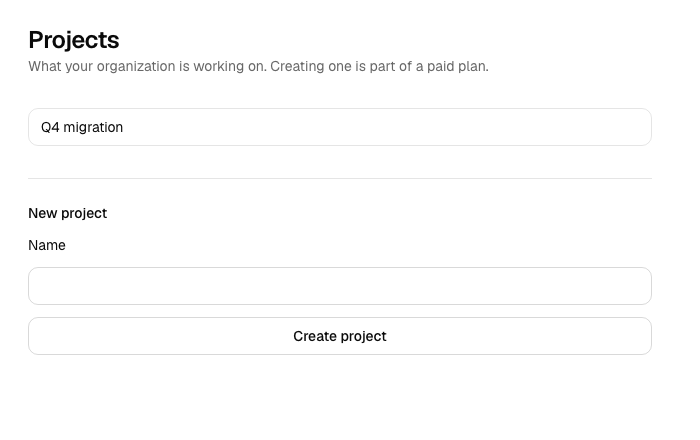

# keelblock

[](https://github.com/itecbrains-source/keelblock/actions/workflows/check.yml)
[](https://github.com/itecbrains-source/keelblock/actions/workflows/nightly.yml)
[](LICENSE)
[](#project-status-honestly)

**A multi-tenant SaaS starter where tenant isolation is enforced by the database and proven on every
commit.** Next.js 16 · React 19 · TypeScript · Supabase · Stripe. MIT.

> **This is work in progress, not a finished product.** Some of it is built and proven; a good deal
> of it is a plan. The block under [What's in it](#whats-in-it) says which is which, and it is
> **generated from the spec catalog** rather than typed, so it cannot quietly drift.
>
> **Believe `npm run status` over any sentence in this file.** It reads the repository. This
> paragraph deliberately makes no per-feature claim, because the one that did was wrong for nine days
> — it called organizations, invitations and billing "specced and not built" while two were `done`
> and the third partial (F-82) — and the sentence that replaced it went stale again within the hour,
> in the other direction, when reconciliation shipped. Prose here carries the argument; the state is
> computed.
>
> This README describes what exists today, not what is planned. If that distinction ever blurs, the
> project has failed its own first rule.

---

## Why this exists

Every comparison of SaaS starters reaches the same conclusion, in their words:

> _"Multi-tenancy, enterprise auth, and audit-grade security are not what these tools produce out of
> the box — they produce a starting point, not a production enterprise system."_

The field is priced $199–$1,499 and closed. The free options are a deliberately minimal reference
kit that uses neither Supabase nor RLS, and one that is three Next majors behind. **None of them —
paid or free — ships proof that its tenant isolation works.**

keelblock is the one that does, and it is free.

## The claim, and how to check it

Isolation is proven per table × command × identity, and the result is published as
**[`docs/ACCESS-MATRIX.md`](docs/ACCESS-MATRIX.md)** — generated from the live policy catalog by
probing the database as each identity, so it describes what the database _does_, not what anyone
believes it does. It is regenerated on every run and a stale copy fails the build, so a policy change
that alters who can reach what shows up as a diff in review.

**A new tick in the "different organization" column is a tenant leak, caught in a document before it
reaches a user.**

### Checking it without installing anything

Two links and one sentence about how they relate:

- **the artifact** — [`docs/ACCESS-MATRIX.md`](docs/ACCESS-MATRIX.md), readable in a browser
- **the runs that produce it** — [the `check` workflow](../../actions/workflows/check.yml), on every
  push and every night

The sentence: `npm run check` includes a gate that regenerates the matrix against a live database and
compares it to the committed copy **byte-for-byte**, failing if they differ. CI runs that gate. So a
green run is not a claim that the matrix was correct once — it is the statement that the file above
is what this database produced on that commit.

Reproducing it yourself needs Docker, the Supabase CLI, `psql`, Node and a Python virtualenv, and
that is a real cost. Reading it, and reading the run that stands behind it, needs none of them.

_A run's downloadable artifacts expire after ninety days; the committed file and the run's log do
not. Cite those._

Four test layers, each answering a different question:

| Layer            | Question                                                 | How                                         |
| ---------------- | -------------------------------------------------------- | ------------------------------------------- |
| Unit             | is this pure logic correct?                              | Vitest, with a mutation proof per gate      |
| Generated policy | does the database enforce what the policies **declare**? | `rlsautotest` → pgTAP, regenerated each run |
| **Intent**       | are the policies **what we meant**?                      | hand-written, adversarial pgTAP             |
| Journey          | does the real authenticated flow work?                   | Playwright _(with auth, SPEC-004)_          |

The middle two are not redundant, and we measured why: a helper that dropped its `user_id` check
produced a **total cross-tenant leak that the generated suite reported as clean** — because it mocks
opaque policy functions. See [F-2](docs/FINDINGS.md).

## What it looks like

The thesis, rendered. An organization with no entitlement row is offered the create form like anyone
else — **the form is never hidden**, because hiding it would move the access decision into
application code, which is the one thing this project refuses. The database declines the write, and
the refusal is what produces the message:



The entitlement row changes. **Same browser, same session, same cookies** — no sign-out, no token
refresh — and the next request succeeds, because entitlement is read per request rather than carried
in a token:



_Both images are captured from the running application by `e2e/capture.spec.ts`, which asserts the
state before photographing it — the refusal message is asserted present and the project asserted
absent, then the shot is taken. They were taken at `3d0fdd9`. Regenerate with the command in that
file's header. A screenshot proves nothing on its own, which is why the walk it shows is also a test
that runs on every push (`e2e/journeys/entitlement.spec.ts`)._

## What we found by measuring

[`docs/FINDINGS.md`](docs/FINDINGS.md) — every finding with a reproduction:

- **`anon` could TRUNCATE every tenant table** on a default Supabase project. RLS does not apply to
  TRUNCATE, so no policy and no policy test could see it. Fixed here for `public`, which is where
  keelblock's tenant tables live — and **still true elsewhere on a default project**: `anon` holds
  `TRUNCATE` on seven tables across `storage`, `net` and `supabase_functions`, measured 2026-09-14.
  The finding's remediation named one schema; the defect is a cluster-wide default.
- **`FORCE ROW LEVEL SECURITY` does not stop the owner** on Supabase — including in the remediation
  the tooling itself recommends.
- **A cross-tenant write is invisible to the attacker**, so a read-based isolation suite structurally
  cannot catch it.
- **Cache Components break every authenticated page** in Next 16 unless the read streams.

Some of these were keelblock's own mistakes — a gate that could not fail, a test suite quietly
editing a committed artifact, a front page describing shipped work as unbuilt. They are published for
the same reason as the rest, and `npm run status` counts them so this sentence does not have to.

## What's in it

**Next.js only** — no Nuxt, no SvelteKit, no TanStack Start, no React Native. That is
what makes feature-completeness affordable rather than a slogan: the field maintains the same feature
set across three frameworks, so keelblock has roughly three times the budget per feature.

<!-- BEGIN:generated:state -->

<!-- Generated by scripts/readme-state.mjs from the spec catalog. Do not edit by hand: change
     the spec, then `npm run generate`. The `generated` gate byte-compares this block. -->

**Built, with every acceptance criterion met:**

Tenancy foundation (`SPEC-001`) · Proof harness (`SPEC-002`) · Gates (`SPEC-003`) · Authentication (`SPEC-004`) · Organizations and roles (`SPEC-005`) · Invitations (`SPEC-006`) · create-keelblock-app (`SPEC-011`) · Upgrade path (`SPEC-013`)

**Partly built** — the criteria still open are listed in each spec:

Billing (`SPEC-007`, 11 of 11) · Docs & the stranger walkthrough (`SPEC-012`, 7 of 8) · Accessibility & performance budgets (`SPEC-015`, 5 of 6) · Handover (`SPEC-024`, 5 of 5)

**Specced and not built** — these are a plan, not a product:

Release preflight (`SPEC-016`) · SEO & structured data (`SPEC-028`) · keelblock.dev — the project's own site, and the pipeline that publishes it (`SPEC-032`)

Anything not named above is not specced either. `npm run status` computes this list; if it ever
disagrees with the block above, the block is stale and the build fails.

<!-- END:generated:state -->

That list is generated from the spec catalog, not typed. It has to be: this paragraph has already
been wrong in **both** directions — F-82 found it calling shipped work unbuilt for nine days, and a
later audit found it listing passkeys, 2FA and email verification, none of which appear anywhere in
`src/`, under a heading that reads as shipped. Which capabilities exist is volatile state, and this
project's rule is that volatile state is computed. `npm run check` fails if the block is stale.

**Deliberately not shipped**, with reasons in [`docs/PRODUCT.md`](docs/PRODUCT.md): five payment
providers, a choice of two ORMs, an AI chatbot demo, a CMS. Each is a comparison-table row bought
with permanent maintenance.

The last three in that list are the interesting ones. The field delegates audit logs, webhooks and
SSO to third-party services — a buyer gets integration code and three vendor bills, and the audit
trail lives _outside_ the isolation boundary the product claims. keelblock builds the three that are
**tenant-isolation surfaces** natively and proves them; delivery infrastructure stays a seam.

## Starting a session

<!-- verified: package-script -->

```bash
npm run status
```

**Computed from the repository, never written down.** What is built, what is open, how many
acceptance criteria remain — read from the specs, the registry and the gates themselves.

This exists because the most expensive failure in a long-running project is not a bug: it is reading
a status document, believing it, and rebuilding something that shipped weeks ago. The rule here is
**durable claims are written down; volatile state is computed** — and a gate enforces it, failing the
build when any document asserts a count that has gone stale ([F-23](docs/FINDINGS.md)).

If a document ever disagrees with `npm run status`, the document is wrong.

## Getting started

**Prerequisites:** Node 26 · Docker (for the local Supabase stack) · the
[Supabase CLI](https://supabase.com/docs/guides/cli) · `psql` (the gates query the database
directly) · Python 3.10+ (the policy prober). `npm run check` names any missing one rather than
failing with a stack trace.

**To start a project — not yet.** The scaffolder is built and tested (SPEC-011), but the npm package
is **a name placeholder and is not functional**. Its own registry description says so. So this
command does **not** work today. It is shown rather than omitted, marked for what it is, because it
is the command that will eventually work and a reader who meets it elsewhere deserves to know that:

<!-- verified: none — the published package is a name placeholder whose own npm description says "Not yet functional"; this command is shown so a reader who meets it elsewhere knows its state -->

```bash
npx create-keelblock-app my-app     # ✗ placeholder on npm — does not scaffold anything yet
```

Publishing it is the one step between that line and a working quick start. Until then, scaffold from
a local checkout, which runs the same code the package will:

<!-- verified: none — the scaffolder itself is covered by SPEC-011 and its own tests, but this exact three-line sequence is not executed by CI from a clean machine -->

```bash
git clone https://github.com/itecbrains-source/keelblock.git && cd keelblock
npm install
node scripts/create-keelblock-app.mjs my-app --from . --ref HEAD
```

The generated project records the release it came from, so it can take a later one — see
`keelblock.provenance.json` and the two-command upgrade the scaffolder prints.

**To work on keelblock itself:**

<!-- verified: none — the setup sequence for contributors; docs/GETTING-STARTED.md is the page CI executes end to end, and it covers the generated-project path rather than this one -->

```bash
git clone <this repo> && cd keelblock
npm install
python3 -m venv .venv && ./.venv/bin/pip install -r requirements.txt   # the policy prober
cp .env.example .env.local                                            # fill from `supabase status`
supabase start
npm run check
```

`npm run check` runs every gate and **reports every failure, not just the first**:

```
════ summary ════
  ✓ typegen     route types are generated
  ✓ typecheck   types are sound
  ✓ format      one style, so review is about content
  ✓ lint        no lint regressions
  ✓ unit        pure logic is correct
  ✓ locale      translations are complete and all used
  ✓ unused      no dead code or unused dependencies
  ✓ freshness   nothing has quietly gone stale
  ✓ promises    every claim is owned, researched, tracked
  ✓ boundaries  the app cannot route around RLS
  ✓ schema      every tenant table is protected
  ✓ policy      the database enforces isolation
  ✓ generated   no committed generated artifact is stale
```

### Running CI locally

CI runs on every push and every night, and the badge above is the only place this README states
whether it passed — because that is volatile state, and this file is for durable claims. `npm run
verify` is for the loop before you push: it closes as much of the gap as a laptop honestly can.

<!-- verified: package-script -->

```bash
npm run verify           # fast — defers the heavy reinstall
npm run verify -- --full # also runs `npm ci`, exactly as CI does
```

It **parses `.github/workflows/check.yml` and executes its steps**, rather than maintaining a second
list of commands beside it — a hand-written mimic drifts from the workflow the first time either
changes, and then proves the wrong thing confidently.

It is deliberate about fidelity, and reports it. `gitleaks` really scans the full history; `npm run
check` really runs. The GitHub-hosted actions (`checkout`, `setup-node`, `setup-python`,
`setup-cli`, `upload-artifact`) cannot execute on a laptop, so their **effects** are asserted instead
— a Node major that does not match CI's pin is a failure, not a shrug. The summary prints the
percentage genuinely executed and names everything it could not verify:

```
ran      N   executed exactly as CI will
local    N   real local equivalent
asserted N   effect checked, action not run
skipped  N   NOT verified

fidelity: NN% of steps genuinely executed
```

**The percentage is stated plainly, whatever it is.** "CI passed locally" is worth nothing if a third
of it was quietly skipped — and the number is printed rather than reproduced here, because a figure
copied into a README is a figure that stops being true.

### Writing application code

[ADR-011](docs/adr/ADR-011-app-router-conventions.md) settles the conventions before the first real
screen sets them by accident. The load-bearing ones:

- **Server Actions for the app, Route Handlers for the outside world.** An action invoked from
  outside the browser breaks the assumptions that make it safe, so anything needing a URL gets
  explicit auth.
- **Every mutation is validate → authorize → act.** A Server Action's argument is untrusted input —
  a network boundary wearing a function's clothes — so it is typed `unknown` and parsed. The type
  annotation you would rather write is a comment.
- **Authorization is the policy, not an `if`.** Actions use the session-carrying client and let RLS
  refuse. An application check may improve the error message; it is never the boundary. That is
  [F-15](docs/FINDINGS.md), the pattern keelblock exists to replace.
- **Database types are generated and gated.** A stale row type does not fail to compile — it compiles
  and is `undefined` in production. `npm run generate` regenerates; the `generated` gate fails when
  it drifts.

### Security headers

Six headers — `Referrer-Policy`, `X-Content-Type-Options`, `X-Frame-Options`, `Permissions-Policy`
and both `Cross-Origin-*` — are **enforced unconditionally**. The CSP ships **report-only by
default**, and that is a measured decision, not caution: a production Next build serves 13 inline
scripts, so an enforcing `script-src 'self'` blocks hydration entirely. You can have any two of
{strict CSP, static prerendering, working hydration} — the trilemma and its proof are in
[F-16](docs/FINDINGS.md). `KEELBLOCK_SECURITY_HEADERS=on` enforces the CSP once you have tuned it.

The production CSP contains **no `'unsafe-eval'` and no `'unsafe-inline'` in `script-src`**, both
pinned by mutation proofs.

### Environment

Validated at boot, with every problem reported at once. A missing variable fails immediately instead
of becoming the string `"undefined"` three layers away — and any `NEXT_PUBLIC_` variable that looks
like a credential is **refused**, because the bundler inlines those into client JavaScript and serves
them to every visitor ([F-17](docs/FINDINGS.md)).

### Internationalization

The `[locale]` route segment ships from the first commit, with **one locale**. Not because keelblock needs
five languages, but because i18n is the one concern that cannot be added later without touching
everything: next-intl's own instructions are _"move all existing layouts and pages into the `[locale]`
segment."_ That cost scales with your screen count, so it is paid here while the app is small.

Adding a language is a message file and one array entry. A gate fails the build on a missing key, a
misspelled `t('key')`, or a key nobody uses — all three of which otherwise fail silently, in a
language nobody on your team reads. See [ADR-010](docs/adr/ADR-010-internationalization.md).

### Three commands, three questions

Deliberately not three names for one job — the cost of a wrong answer rises sharply down the list:

| Command             | Question                     | A wrong answer costs                                |
| ------------------- | ---------------------------- | --------------------------------------------------- |
| `npm run check`     | is this code correct?        | a red build                                         |
| `npm run verify`    | will CI pass?                | a round trip, and real CI minutes on a private repo |
| `npm run preflight` | **is this safe to release?** | **an outage, or a tenant leak in production**       |

The third matters most to a team shipping a commercial product on a private repo, and it is the one
no starter ships: _is this migration safe with the old code still running · has the target's schema
drifted from the repository, in either direction · does the access matrix in production still match
the committed one · are the required secrets actually set._ Specified in
[SPEC-016](spec/SPEC-016-release-preflight.md) — **not yet built.**

## How it is built

| Decision                                                       | Where                                                     |
| -------------------------------------------------------------- | --------------------------------------------------------- |
| `organization` as the tenant root; membership as the boundary  | [ADR-001](docs/adr/ADR-001-tenancy-model.md)              |
| Supabase Auth, so policies key off `auth.uid()` with no bridge | [ADR-002](docs/adr/ADR-002-auth.md)                       |
| `supabase-js` for queries, hand-written SQL for policies       | [ADR-003](docs/adr/ADR-003-data-access.md)                |
| Cache Components, tenant-scoped keys                           | [ADR-004](docs/adr/ADR-004-rendering-and-cache.md)        |
| Four test layers; the generated suite cannot judge intent      | [ADR-005](docs/adr/ADR-005-testing.md)                    |
| Stripe bills, the database entitles                            | [ADR-006](docs/adr/ADR-006-billing.md)                    |
| Freshness gate — staleness fails the build                     | [ADR-007](docs/adr/ADR-007-supply-chain-and-freshness.md) |
| Upgradability — a security fix must be able to reach you       | [ADR-008](docs/adr/ADR-008-upgradability.md)              |
| Open core — proof is free, audit evidence is paid              | [ADR-009](docs/adr/ADR-009-open-core-boundary.md)         |

Scope, non-goals and the acceptance bars: [`docs/PRODUCT.md`](docs/PRODUCT.md).

## Contributing

[`CONTRIBUTING.md`](CONTRIBUTING.md). Security issues: [`SECURITY.md`](SECURITY.md) — privately, please.

## License

**MIT** — [`LICENSE`](LICENSE). Free, open, and no paid tier of this repository exists or is planned;
D-1 in [`docs/PRODUCT.md`](docs/PRODUCT.md) records why, and D-3 records the one boundary that is not
free: a separate compliance-evidence layer. **keelblock's full claim must hold with nothing paid
installed, and a gate asserts it.**

Use it for anything, including commercially. Attribution is appreciated and not required.

## Project status, honestly

This is **work in progress and not a finished product.** The tenancy layer, sign-in, organizations
and invitations are built and proven; billing is partly built; most of the list above is not built at
all. The scaffolder's npm package is a placeholder. Nothing here is running in production for anyone.

What this repository does claim is narrower and is checkable: **the isolation it has built, it
proves** — on every push, per table, per command, per identity, with a mutation proof behind every
gate. `npm run status` computes the rest, and it is the only thing to believe over this file.
